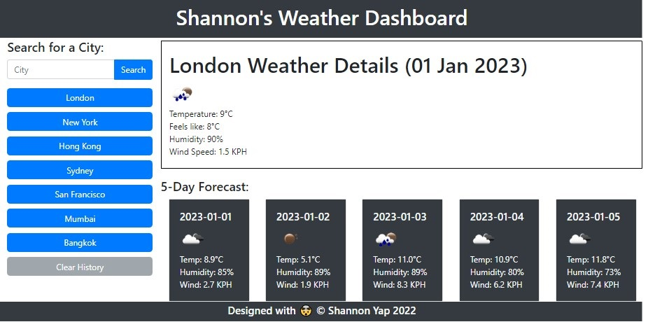

# weather-dashboard-shannon

## Description

As a review of the materials we learnt in our eighth week, our **Week 8 Challenge** will test our skills in HTML, CSS, JavaScript and Server API along with jQuery by having us create a 5-day Weather Forecast Dashboard.

In this web application, I have applied the following skills:

>00. jQuery
>01. JavaScript
>02. API-Key
>03. Google-fu
>04. Google-fu
>05. Lots of tears
>06. Google-fu
>07. Googling Youtube
>08. Google-fu

## Installation

N/A

## Usage 

Search for a city and you'll be presented with current and future conditions for that city and that city is added to the search history:

* The city name
* The date
* An icon representation of weather conditions
* The temperature
* The humidity
* The wind speed

Bonus... you can clear the saved events by clicking the grey "Clear History" button.

Weather Dashboard Website:

https://damnsemicolon.github.io/weather-dashboard-shannon

Screenshot of deployed website:

## Credits

Philip Howley (Instructor) 
Nic Catania (TA) 
Pod-4 mates 
Myself

## License

## Badges

